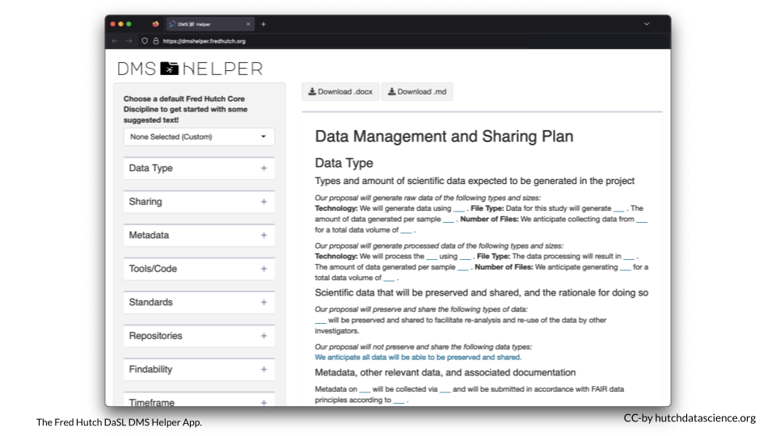

# DMS Helper App {-}

The Fred Hutch Data Science Lab has created and online app where you can create your NIH Data Management and Sharing Plan. It includes template text corresponding to different Fred Hutch Research Cores. You can download your filled-in plan in either Word or Markdown format.

https://dmshelper.fredhutch.org/

