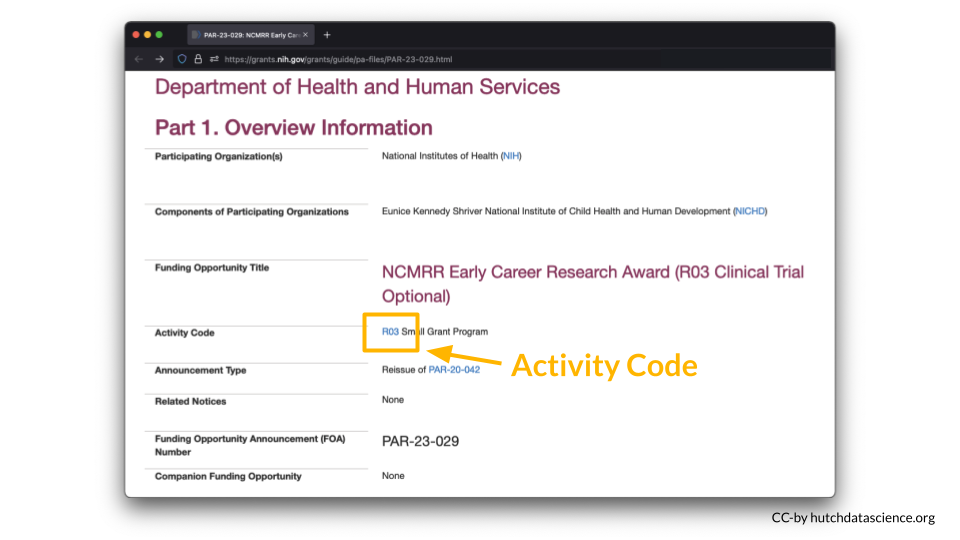
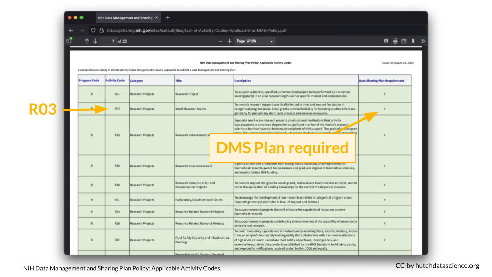

# (PART\*) Introduction {-}

# Why this new DMS policy?

First we will discuss the motivations behind the new data management and sharing policy that will go into effect for (most) grant proposals submitted to the NIH after January 25, 2023.

So why is the NIH doing this? There are several reasons why sharing data can be beneficial to the scientific community.

- **Supports transparency** - Sharing data provides more clarity about how studies are performed. Many scientists also believe in an ethical responsibility to study participants [@bauchner_citation_2016].
- **Encourages reproducibility and rigor** - Having the data accessible, allows others to try to reproduce study findings. This can further enable studies that may replicate or validate the initial findings with different data. 
- **Supports multi-modal work** - When more data of various types are easily available it makes it easier for scientist to perform studies with multiple types of data [@thessen_citation_2021]. 
- **More efficient and cost effective** - Some data are especially difficult or expensive to produce.
- **Supports Researcher Inclusion** - Data generation can be especially difficult for those at institutes with less resources. Publicly available data can therefore be used by these researchers to better enable their participation. 
- **Increased impact** - Papers that share their data in repositories appear to be cited more based on the study by @colavizza_citation_2020 .
- **Increased collaboration opportunity** - Having data available can encourage other researchers to expand the research in a new direction or extend it further and they may reach out to collaborate.
- **Data Citations** - Due to the importance of data generation and sharing to the NIH, data will now be seen as research product that demonstrates a contribution to the scientific community.

## Key terms 

**Data Management**

The work involved with validating, organizing, protecting, maintaining, and processing scientific data to ensure the accessibility, reliability, and quality of the scientific data for its users. All data should be managed.

**Data Sharing**

The act of making scientific data available for use by others (e.g., the larger research community, institutions, the broader public), for example, via an established repository. Some data meet criteria to be exempt from data sharing.

**Metadata**

Data that provide additional information intended to make scientific data interpretable and reusable (e.g., date, independent sample and variable construction and description, methodology, data provenance, data transformations, any intermediate or descriptive observational variables).

**Data Management and Sharing Plan (Plan)**

A plan describing the data management, preservation, and sharing of scientific data and accompanying metadata.

# Will this policy affect me?

> You can refer to the [NIH overview](https://sharing.nih.gov/data-management-and-sharing-policy/about-data-management-and-sharing-policy/research-covered-under-the-data-management-sharing-policy#after){target="_blank"} of which research will be covered by this new policy.  

The major requirement of the policy is that all grant proposals (submitted after January 25th, 2023) for mechanisms that require compliance, must include a plan for how they will manage and share their data. 

For certain grant mechanisms for projects that do not generate data, compliance with the policy is not required. For certain types of data, sharing is not possible, and a justification will be required instead. 

The following outline several key questions:

- **Is my research exempt from the policy?**
- **Does my research generate scientific data?** If yes, you will need to submit a DMS Plan.
- **When do I need to share my data?**
- **Can I elect to not share data?** The short answer is yes. However, you must still justify this choice in a submitted DMS Plan.

To determine if your research requires compliance with other policies that may influence how you share your data, take this [quiz](https://sharing.nih.gov/other-sharing-policies/which-policies-apply-to-my-research).

## What grant mechanisms don't require compliance with the DMS policy?

The DMS Policy applies to all research that generates [scientific data](#scientific-data), including:

- Research Projects
- Some Career Development Awards (K)
- Small Business SBIR/STTR 
- Research Centers

The DMS Policy does not apply to research and other activities that do not generate scientific data, including:

- Training (T)
- Fellowships (F)
- Construction (C06)
- Conference Grants (R13)
- Resource (G)
- Research-Related Infrastructure Programs (e.g., S06)

You can look up your NIH Activity Code [here](https://sharing.nih.gov/sites/default/files/List-of-Activity-Codes-Applicable-to-DMS-Policy.pdf){target="_blank"} to see if you are required to submit a DMS Plan.

For example, I am interested in applying to a **R03** award.

According to the table, a **DMS Plan is required** for this particular award.

## Does my research generate scientific data? {#scientific-data}

The NIH Data Management and Sharing (DMS) Policy applies to **all NIH-supported research generating scientific data**. But what is "scientific data"?

### Scientific data

Scientific data are the “recorded factual material of sufficient quality to validate and replicate research findings, regardless of whether the data are used to support scholarly publications”. This can include any of the following if they are applicable to your study:

- unpublished results
- null results
- results used to publish papers

### Not scientific data

You are not expected to share:

- lab notebooks
- preliminary analyses
- case report forms
- drafts of scientific papers
- plans for future research
- peer reviews
- communications with colleagues
- physical objects (such as biospecimens)

<!-- 
 -->

<!-- You might be wondering if it is required to share raw data.  -->

<!-- The DMS Policy applies to **final research data**. This is data that is recorded factual material commonly accepted in the scientific community as necessary to **validate and replicate** research findings. For many scientific areas, final research data includes both raw data and analyses conducted on the data.  -->

<!-- For example, final research data for a clinical study would include a dataset that was used in the published study, but not the clinical documents (for example, medical records) that the dataset was derived from.  -->

<!-- For genomic data, raw sequence reads are generally not expected unless a de novo sequencing experiment was performed. Sequence alignments however are expected to be shared. For more information about genomic data sharing, see the details of the policy [here](https://sharing.nih.gov/genomic-data-sharing-policy/submitting-genomic-data/data-submission-and-release-expectations){target="_blank"}. -->

<!-- 
 -->

## What is the timeline for sharing data?

Data should be made available **no later than publication or end of the award**. This means that data underlying findings that are not published in peer-reviewed journals should be made available by the end of the award.

### What about no cost extensions?

Scientific data should be made accessible as soon as possible, and no later than the time of an associated publication or the end of the performance period of the extramural award that generated the data. If a no cost extension is granted for an extramural award, scientific data should be made accessible no later than the time of an associated publication, or the end of the no cost extension, whichever comes first.

### What about grant renewals? 

<!-- Fill in here -->

## Can I elect to not share data?

There are legitimate reasons you might not want to share your data. Data might not be shareable due to ethical, legal, or technical concerns. **You will still need to submit a DMS Plan even if you plan to withhold data sharing**. You must explain your reasoning in your DMS Plan.

Justifiable ethical, legal, and technical factors for limiting sharing of data include: 

- Informed consent will not permit or will limit the scope or extent of sharing and future research use
- Existing consent (e.g., for previously collected biospecimens) prohibits sharing or limits the scope or extent of sharing and future research use
- Privacy or safety of research participants would be compromised or place them at greater risk of re-identification or suffering harm, and protective measures such as de-identification and [Certificates of Confidentiality](https://grants.nih.gov/policy/humansubjects/coc.htm) would be insufficient. _At Fred Hutch, you should get in contact with the [Institutional Review Office](https://centernet.fredhutch.org/cn/u/iro.html){target="_blank"} if you have questions about compliance of your research._
- Explicit federal, state, local, or Tribal law, regulation, or policy prohibits disclosure 
- Restrictions are imposed by existing or anticipated agreements with other parties 
- Datasets cannot practically be digitized with reasonable efforts

 
 What if my data are proprietary? (click for more information) 

**Considerations for Proprietary Data (directly from the NIH)**

NIH understands that some scientific data generated with NIH funds may be proprietary. Under the Small Business Innovation Research (SBIR) and Small Business Technology Transfer (STTR) Program Policy Directive, effective May 2, 2019, SBIR and STTR awardees may withhold applicable data for 20 years after the award date, as stipulated in the specific SBIR/STTR funding agreement and consistent with achieving program goals. SBIR and STTR awardees are expected to submit a Data Management & Sharing Plan per DMS Policy requirements.

Issues related to proprietary data also can arise when co-funding is provided by the private sector (for example, the pharmaceutical or biotechnology industries). NIH recognizes that the extent of data sharing may be limited by restrictions imposed by licensing limitations attached to materials needed to conduct the research. Applicants should discuss projects with proposed collaborators early to avoid agreements that prohibit or unnecessarily restrict data sharing. NIH staff will evaluate the justifications of investigators who believe that they are unable to share data.

For questions or concerns about data sharing expectations for proprietary data, please contact the [Office of Science Policy](mailto:SciencePolicy@od.nih.gov). Small businesses may wish to contact the [NIH SEED Office](https://public.era.nih.gov/commons/public/servicedesk/initseed.era).

Some additional reasons to limit sharing:

- NIH respects Tribal sovereignty and supports responsible management/sharing of American Indian / Alaska Native participant data, which can include limiting sharing
- SBIR/STTR Program Policy Directive permits withholding data for 20 years, as stipulated in agreements and consistent with program goals 

The following are **NOT** good reasons to limit the sharing of your data: 

- Data are considered too small 
- Researchers anticipate data will not be widely used
- Data are not thought to have a suitable repository 
- You don't have the right personnel to manage data or share data
- You don't want to pay for data storage
