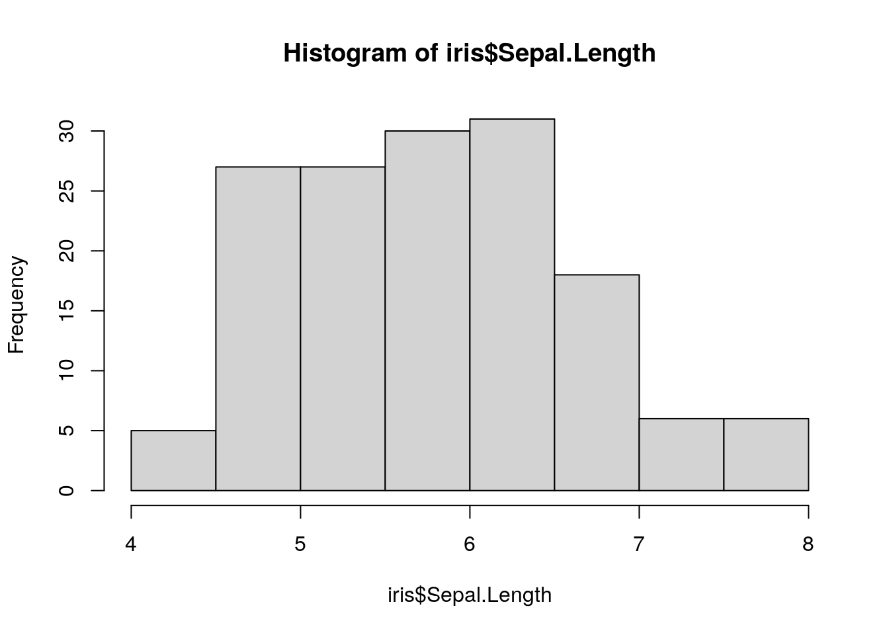

# A new chapter

 
1. Reasons for the new NIH data sharing plan/benefits
- more transparency/reproducibility/validation
- more multi-modal analysis
- more efficient (some data hard to generate)
- support those with less resources where data generation might be difficult
- increases in citations
- increase collaborations
- data citations (data will now be seen as research product)
2. When does the sharing plan go into effect
3. When compliance is required (bit confused about training wards for T and F - I think they are saying don't need to only when they don't generate data, but they definitely often do)
  - what is scientific data and what it is not
4. Major aspects: 
  - need to submit Data Management and Sharing (DMS) plan with all applications after Jan 2023
  - would need to actually share or not share your data based on what plan gets approved
 - importantly you do not need to necessarily share your data, but you need to submit a DMS with a justification about why you shouldn't share your data
5. Reasons why you might not share your data
 - legal/ethical/technical (I think being too large to be cost prohibitive is possible)
 examples 
 - Unacceptable reasons why you might not share your data
 examples
6. DMS elements
   - less than 2 pages
   - Initially not public now.. but may in the future (so don't include anything confidential or proprietary)
    1. Data type
    2. tools/code (note code is not required to be shared)
    3. standards
    4. data preservation, access, timelines
      - no later than the time of publication of findings or the end of the award (whatever comes first) This probably stresses people out... maybe you can justify longer timelines? 
      - renewals can have updated DMS plan with a different timeline, but if not approved must use previous DMS date
      - no cost extension also allows for more time
    5. access, distribution, reuse
      - no specification of how long need to be available, journals may have other requirements
    6. oversight - who will compliance be manged by
7. Implementation details
- other plans field added to forms H filed of the PHS 398 research plan form/career development supplemental form
- Resource sharing plans will not be going away (but will not be about data - tools and model organisms)- instructions will be updated
- No longer separate data sharing or genomic data sharing plans

8. Where to share data?
- currently no NIH requirements except encouraging established repositories, but this may change 
- link to searchable NIH supported repositories and otherwise encouraged repositories
- info about other types of data that aren't covered by these repositories

9. What if it will cost a lot to share data?
- can request for funding support
    - allowable costs (de-identification, deposition fees)
    - unallowable data (infrastructure costs (this should be indirect costs) and costs related to conducting the research - like gaining access to the data)
    - don't double up requests for direct and indirect support
    - activities that get supported must happen during project period (for example if storing data for 10 years - must pay for those years in advance)
    - budget implementation details
    
10. common concerns
- can update plan if not accepted (just in time)
- can also update during regular reporting intervals - thus need to show that you made a plan but it's OK if things change (but these will need to be approved)
    
 11. Other details
 -Unique persistent identifiers are not required (such as a DOI but they are encouraged)
  
  

 


## Learning Objectives

Every chapter also needs Learning objectives that will look like this:  

This chapter will cover:  

- {You can use https://tips.uark.edu/using-blooms-taxonomy/ to define some learning objectives here}
- {Another learning objective}


## 

## Code examples

You can demonstrate code like this:


```r
output_dir <- file.path("resources", "code_output")
if (!dir.exists(output_dir)) {
  dir.create(output_dir)
}
```

And make plots too:


```r
hist_plot <- hist(iris$Sepal.Length)
```



You can also save these plots to file:


```r
png(file.path(output_dir, "test_plot.png"))
hist_plot
```

```
## $breaks
## [1] 4.0 4.5 5.0 5.5 6.0 6.5 7.0 7.5 8.0
## 
## $counts
## [1]  5 27 27 30 31 18  6  6
## 
## $density
## [1] 0.06666667 0.36000000 0.36000000 0.40000000 0.41333333 0.24000000 0.08000000
## [8] 0.08000000
## 
## $mids
## [1] 4.25 4.75 5.25 5.75 6.25 6.75 7.25 7.75
## 
## $xname
## [1] "iris$Sepal.Length"
## 
## $equidist
## [1] TRUE
## 
## attr(,"class")
## [1] "histogram"
```

```r
dev.off()
```

```
## png 
##   2
```

## Image example

How to include a Google slide. It's simplest to use the `ottrpal` package:


But if you have the slide or some other image locally downloaded you can also use HTML like this:


## Video examples
You may also want to embed videos in your course. If alternatively, you just want to include a link you can do so like this:

Check out this [link to a video](https://www.youtube.com/embed/VOCYL-FNbr0) using markdown syntax. 

### Using `knitr`

To embed videos in your course, you can use `knitr::include_url()` like this:
Note that you should use `echo=FALSE` in the code chunk because we don't want the code part of this to show up. If you are unfamiliar with [how R Markdown code chunks work, read this](https://rmarkdown.rstudio.com/lesson-3.html).


<iframe src="https://www.youtube.com/embed/VOCYL-FNbr0" width="672" height="400px"></iframe>

### Using HTML

<iframe src="https://www.youtube.com/embed/VOCYL-FNbr0" width="672" height="400px"></iframe>

## File examples

You can again use simple markdown syntax to just include a link to a file like so:

[A file](https://www.bgsu.edu/content/dam/BGSU/center-for-faculty-excellence/docs/TLGuides/TLGuide-Learning-Objectives.pdf).

Alternatively you can embed files like PDFs.

### Using `knitr`

<iframe src="https://academicaffairs.ucsc.edu/events/documents/Microaggressions_Examples_Arial_2014_11_12.pdf" width="100%" height="400px"></iframe>


### Using HTML

<iframe src="https://academicaffairs.ucsc.edu/events/documents/Microaggressions_Examples_Arial_2014_11_12.pdf" width="672" height="800px"></iframe>

## Website Examples

Yet again you can use a link to a website like so:

[A Website](https://yihui.org)

Or, you can embed some websites.

### Using `knitr`

This works:

<iframe src="https://yihui.org" width="672" height="400px"></iframe>


### Using HTML

<iframe src="https://yihui.org" width="672" height="400px"></iframe>

## Citation examples

We can put citations at the end of a sentence like this [@rmarkdown2021].
Or multiple citations [@rmarkdown2021, @Xie2018].

but they need a ; separator [@rmarkdown2021; @Xie2018].

In text, we can put citations like this @rmarkdown2021.

## Stylized boxes

Occasionally, you might find it useful to emphasize a particular piece of information. To help you do so, we have provided css code and images (no need for you to worry about that!) to create the following stylized boxes. 

You can use these boxes in your course with either of two options: using HTML code or Pandoc syntax.

### Using `rmarkdown` container syntax

The `rmarkdown` package allows for a different syntax to be converted to the HTML that you just saw and also allows for conversion to LaTeX. See the [Bookdown](https://bookdown.org/yihui/rmarkdown-cookbook/custom-blocks.html) documentation for more information [@Xie2020]. Note that Bookdown uses Pandoc.


```
::: {.notice}
Note using rmarkdown syntax.

:::
```

::: {.notice}
Note using rmarkdown syntax.

:::

As an example you might do something like this:

::: {.notice}
Please click on the subsection headers in the left hand
navigation bar (e.g., 2.1, 4.3) a second time to expand the
table of contents and enable the `scroll_highlight` feature
([see more](introduction.html#scroll-highlight))
:::


### Using HTML

To add a warning box like the following use:

```
<div class = "notice">
Followed by the text you want inside
</div>
```

This will create the following:

<div class = "notice">

Followed by the text you want inside

</div>

Here is a `<div class = "warning">` box:

<div class = "warning">

Note text

</div>

Here is a `<div class = "github">` box:

<div class = "github">

GitHub text

</div>


Here is a `<div class = "dictionary">` box:

<div class = "dictionary">

dictionary text

</div>


Here is a `<div class = "reflection">` box:

<div class = "reflection">

reflection text

</div>


## Dropdown summaries

<details><summary> You can hide additional information in a dropdown menu </summary>
Here's more words that are hidden.
</details>

## Print out session info

You should print out session info when you have code for [reproducibility purposes](https://jhudatascience.org/Reproducibility_in_Cancer_Informatics/managing-package-versions.html).


```r
devtools::session_info()
```

```
## ─ Session info ───────────────────────────────────────────────────────────────
##  setting  value                       
##  version  R version 4.0.2 (2020-06-22)
##  os       Ubuntu 20.04.3 LTS          
##  system   x86_64, linux-gnu           
##  ui       X11                         
##  language (EN)                        
##  collate  en_US.UTF-8                 
##  ctype    en_US.UTF-8                 
##  tz       Etc/UTC                     
##  date     2022-10-19                  
## 
## ─ Packages ───────────────────────────────────────────────────────────────────
##  package     * version    date       lib source                            
##  assertthat    0.2.1      2019-03-21 [1] RSPM (R 4.0.3)                    
##  bookdown      0.24       2022-02-15 [1] Github (rstudio/bookdown@88bc4ea) 
##  callr         3.4.4      2020-09-07 [1] RSPM (R 4.0.2)                    
##  cli           2.0.2      2020-02-28 [1] RSPM (R 4.0.0)                    
##  crayon        1.3.4      2017-09-16 [1] RSPM (R 4.0.0)                    
##  curl          4.3        2019-12-02 [1] RSPM (R 4.0.3)                    
##  desc          1.2.0      2018-05-01 [1] RSPM (R 4.0.3)                    
##  devtools      2.3.2      2020-09-18 [1] RSPM (R 4.0.3)                    
##  digest        0.6.25     2020-02-23 [1] RSPM (R 4.0.0)                    
##  ellipsis      0.3.1      2020-05-15 [1] RSPM (R 4.0.3)                    
##  evaluate      0.14       2019-05-28 [1] RSPM (R 4.0.3)                    
##  fansi         0.4.1      2020-01-08 [1] RSPM (R 4.0.0)                    
##  fs            1.5.0      2020-07-31 [1] RSPM (R 4.0.3)                    
##  glue          1.6.1      2022-01-22 [1] CRAN (R 4.0.2)                    
##  highr         0.8        2019-03-20 [1] RSPM (R 4.0.3)                    
##  hms           0.5.3      2020-01-08 [1] RSPM (R 4.0.0)                    
##  htmltools     0.5.0      2020-06-16 [1] RSPM (R 4.0.1)                    
##  httr          1.4.2      2020-07-20 [1] RSPM (R 4.0.3)                    
##  jquerylib     0.1.4      2021-04-26 [1] CRAN (R 4.0.2)                    
##  knitr         1.33       2022-02-15 [1] Github (yihui/knitr@a1052d1)      
##  lifecycle     1.0.0      2021-02-15 [1] CRAN (R 4.0.2)                    
##  magrittr      2.0.2      2022-01-26 [1] CRAN (R 4.0.2)                    
##  memoise       1.1.0      2017-04-21 [1] RSPM (R 4.0.0)                    
##  ottrpal       0.1.2      2022-02-15 [1] Github (jhudsl/ottrpal@1018848)   
##  pillar        1.4.6      2020-07-10 [1] RSPM (R 4.0.2)                    
##  pkgbuild      1.1.0      2020-07-13 [1] RSPM (R 4.0.2)                    
##  pkgconfig     2.0.3      2019-09-22 [1] RSPM (R 4.0.3)                    
##  pkgload       1.1.0      2020-05-29 [1] RSPM (R 4.0.3)                    
##  prettyunits   1.1.1      2020-01-24 [1] RSPM (R 4.0.3)                    
##  processx      3.4.4      2020-09-03 [1] RSPM (R 4.0.2)                    
##  ps            1.3.4      2020-08-11 [1] RSPM (R 4.0.2)                    
##  purrr         0.3.4      2020-04-17 [1] RSPM (R 4.0.3)                    
##  R6            2.4.1      2019-11-12 [1] RSPM (R 4.0.0)                    
##  readr         1.4.0      2020-10-05 [1] RSPM (R 4.0.2)                    
##  remotes       2.2.0      2020-07-21 [1] RSPM (R 4.0.3)                    
##  rlang         0.4.10     2022-02-15 [1] Github (r-lib/rlang@f0c9be5)      
##  rmarkdown     2.10       2022-02-15 [1] Github (rstudio/rmarkdown@02d3c25)
##  rprojroot     2.0.2      2020-11-15 [1] CRAN (R 4.0.2)                    
##  sessioninfo   1.1.1      2018-11-05 [1] RSPM (R 4.0.3)                    
##  stringi       1.5.3      2020-09-09 [1] RSPM (R 4.0.3)                    
##  stringr       1.4.0      2019-02-10 [1] RSPM (R 4.0.3)                    
##  testthat      3.0.1      2022-02-15 [1] Github (R-lib/testthat@e99155a)   
##  tibble        3.0.3      2020-07-10 [1] RSPM (R 4.0.2)                    
##  usethis       2.1.5.9000 2022-02-15 [1] Github (r-lib/usethis@57b109a)    
##  vctrs         0.3.4      2020-08-29 [1] RSPM (R 4.0.2)                    
##  withr         2.3.0      2020-09-22 [1] RSPM (R 4.0.2)                    
##  xfun          0.26       2022-02-15 [1] Github (yihui/xfun@74c2a66)       
##  yaml          2.2.1      2020-02-01 [1] RSPM (R 4.0.3)                    
## 
## [1] /usr/local/lib/R/site-library
## [2] /usr/local/lib/R/library
```
