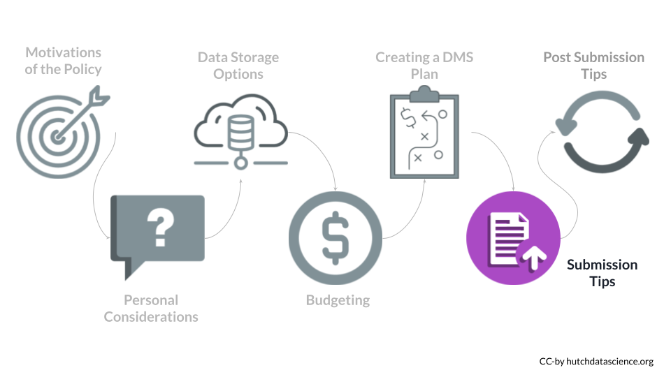
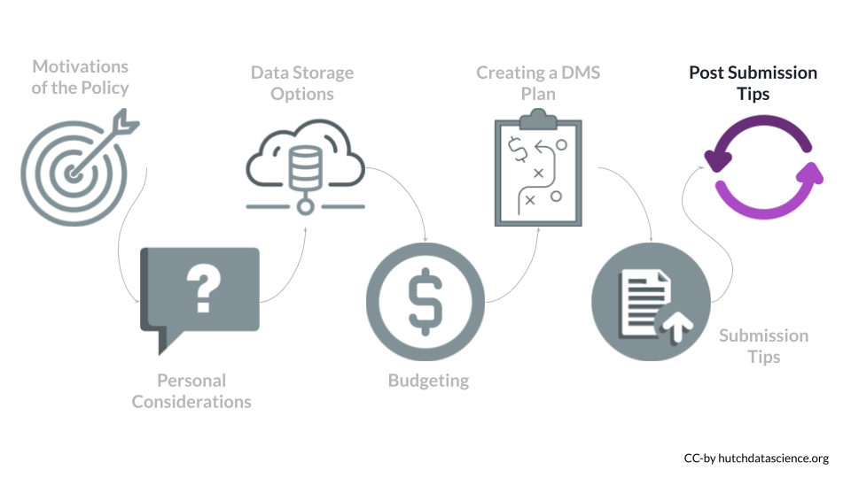

# (PART\*) DMS Submission Process {-}

# Presubmission Tips

- Extramural (grants)
    - DMS plans should be included within the “Other Plan(s)" field on the following forms:

 - for grants not related to career development: [PHS 398 Research Plan](https://grants.nih.gov/grants/how-to-apply-application-guide/forms-h/general-forms-h.pdf).
        - for career development grants: [PHS 398 Career Development Award Supplemental Form](https://grants.nih.gov/grants/how-to-apply-application-guide/forms-h/career-forms-h.pdf).
    - A brief summary and associated costs should be submitted as part of the budget and budget justification.
- Extramural (contracts)
  - DMS plans should be included as part of the technical evaluation
- Intramural
  - Check with the Intramural Research Program
- Other funding agreements
  - Plans should be submitted prior to the release of funds

## Other Submission Tips:

- Resource sharing plans will not be going away (but will **not** be about data and will instead focus on tools and model organisms)
- There will not be a separate [genomic data sharing](https://sharing.nih.gov/genomic-data-sharing-policy/about-genomic-data-sharing/gds-policy-overview) plan. Genomic data sharing plans should simply be included in the overall DMS plan.

# Post Submission Tips

- You can update your DMS plan if is not accepted during the [Just-in-Time](https://grants.nih.gov/grants/policy/nihgps/HTML5/section_2/2.5.1_just-in-time_procedures.htm) process
- You can also update your DMS plan during regular reporting intervals (but these changes will need to be approved)
- Investigators are expected to report progress made on data sharing in their Research Progress Performance Report (RPPR)
  

