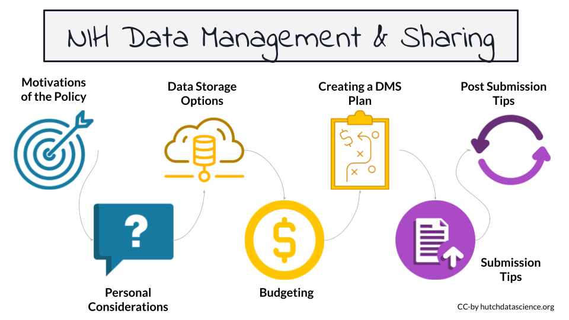

# About this Course {-}

The [National Institutes of Health (NIH)](https://www.nih.gov/) policy for the management and sharing of scientific data applies for (most) grants submitted.

The main requirement of this new policy is that researchers include a Data Management and Sharing (DMS) plan with their proposal. **Not all research will require data sharing.** However, everyone must provide a justification if they can't share their data.

Once a DMS plan is accepted by the funding agency, the researchers will be required to carry out the plan. However, updates can be made to the plan as well during the [Just-in-Time process](https://grants.nih.gov/grants/policy/nihgps/html5/section_2/2.5.1_just-in-time_procedures.htm).

In this course we will describe what the new policy requires, places where you might want to share your particular kind of data, and how to deal with possible challenges associated with the policy.

**Disclaimer**

These materials have been developed at Fred Hutch for the purpose of assisting our faculty scientists with the new NIH data sharing policy requirements.  While we are confident in the content of these materials, we make no guarantee that they will fully comply with NIH's policy.  This is a new policy, and only time will tell.  We will revise these materials on an on-going basis, as appropriate.

# Video Summary {-}

Check out the video below. It provides a summary and introduction to this course.

<iframe width="560" height="315" src="https://www.youtube-nocookie.com/embed/Lbn1edKfUb0" title="YouTube video player" frameborder="0" allow="accelerometer; autoplay; clipboard-write; encrypted-media; gyroscope; picture-in-picture" allowfullscreen></iframe>

# Format and Audience {-}

## Course Format

:::{.notice}
This course is available in [Bookdown](https://hutchdatascience.org/NIH_Data_Sharing/) and [Leanpub](https://leanpub.com/courses/fredhutch/nih_data_sharing) formats. The Bookdown format allows you to browse the content on a web page. Creating a free account with Leanpub allows you to take quizzes on the material and earn a certificate of completion.
:::

## Motivation

We want to help make the process of compliance with the new NIH Data Management and Sharing Policy  [`https://sharing.nih.gov/`](https://sharing.nih.gov/) easier. 

## Target Audience  

The course is intended for anyone who plans to submit a grant proposal to the NIH after January 25th, 2023.

# Course Overview {-}

## Curriculum  

The course will cover:

- Motivations behind the new policy
- Overview of the new policy requirements and how it may affect you
- Suggestions about where to share your data
- Recommendations about how to budget for your data
- Guidance about how to write a DMS plan
- Information on how to submit the DMS plan to funding agencies
- Guidance on how to update a DMS plan after submission or funding
- General tips and frequently asked questions

 

## Overall Takeaways

**Why this change?** As of January 23, 2023, the NIH is requiring all grant proposals include a Data Management and Sharing Plan to aid in the transparency and reproducibility of NIH-funded research.

**Does this apply to me?** This will apply to most NIH grants that create data (regardless of funding level), although some grant mechanisms and some data are exempt. **It is not required to share all data**, however a justification is required. Reasons not to share that are acceptable may be ethical, technical, or legal.

**Where should I share my data?** The NIH has lists of suggested repositories, to help you find appropriate repositories for your data. If there is not an appropriate repository, you can share your data at an institutional (if available) or generalist repository.

**How do I budget this?** You may request funds for data management and sharing as direct costs (including personnel costs). Infrastructure costs should only be included as indirect costs.

**How do I write my plan?** Your plan should be < 2 pages (without hyperlinks) and include sections on data type; tools, software, and code; standards; data preservation, access, and timelines; access, distribution, and reuse considerations; and oversight. **You may be able to change your plan** in the just-in-time process or during regular reporting intervals. Changes require approval.

**Will my plan influence my grant score?** Although the Data Management and Sharing Plan is a mandatory part of most grant proposals, it will not be shared with reviewers and thus will not influence your score, however the budget will be visible to reviewers.

**Final Considerations**

This is a new policy for the NIH and they are expecting to have some growing pains. While they don't currently have specific expectations, the NIH has stated they will learn from the process as it happens along with the scientists submitting grant proposals under the new policies. In general, it's best to be mindful of what is **actually feasible** when it comes to managing and storing your data and try not overstate what you might be able to do.

## Authors

This course was developed by the [Fred Hutch Data Science Lab](https://hutchdatascience.org/). Please see the [author credits](#about-the-authors) for more information. The slides for the course are available [here](https://docs.google.com/presentation/d/1luFoDzF6aDJEebbL6iWoJ_s8s9nQnaWLL5jghbmWdak/edit?usp=sharing).
